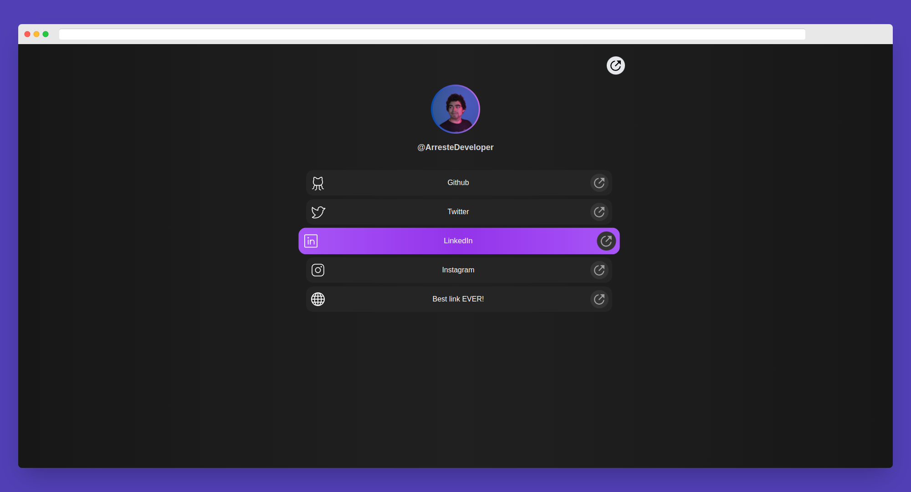

<h1 align="center">linkmee</h1>

<p align="center">
  
  
  
  
  
</p>

<p align="center">
  A linktr.ee alike site where you can centralize your links with beautiful SVG icons.
  <br>
  <br>
  <a href="https://github.com/jonathanbc10/linkmee/issues/new">Report Bug</a>
  ·
  <a href="https://github.com/jonathanbc10/linkmee/issues/new">Request Feature</a>
</p>

## Description

linkmee is a linktr.ee alike site that allows you to centralize your links and present them with beautiful SVG icons. With linkmee, you can create a personalized page with your social media profiles, website, and any other important links you want to share. The site provides a clean and visually appealing interface, making it easy for visitors to navigate and access your various links.

The project is built using React and utilizes SVG icons for each link. It leverages Vite as the development server and build tool.

## Preview



## Installation

To set up linkmee on your local machine, follow these steps:

1. Clone the repository:

```shell
git clone https://github.com/jonathanbc10/linkmee.git
```

2. Install the dependencies:
```shell
npm install
```

3. Start the development server:
```shell
npm run dev
```

4. Open your browser and visit `http://localhost:5173` to view linkmee.

## Usage

To customize linkmee with your own links and profile information, follow these steps:

1. Open the `./src/data/index.js` file.

2. Modify the `profileInfo` object with your username and profile picture:

```javascript
export const profileInfo = {
  username: "YourUsername",
  pic: profilepic, // Replace with your profile picture import
};
```

3. Customize the `links` array with your desired links. Each link object should have a name, link URL, and corresponding icon:

```javascript
export const links = [
  {
    name: "Github",
    link: "https://github.com/jonathanbc10",
    icon: GithubIcon, // Replace with your icon import
  },
  // Add more links here
];
```

4. Save the file, and the changes will reflect in the linkmee site.

## Contributing
Contributions and improvements to linkmee are welcome! To contribute, please follow these steps:

1. Fork this repository.

2. Create a new branch: `git checkout -b {feature/fix/refactor}/my-new-feature`.

3. Make your changes and commit them: `git commit -am "Add new feature"`.

4. Push to the branch: `git push origin {feature/fix/refactor}/my-new-feature`.

5. Open a Pull Request, and I will review your changes.

## License
This project is licensed under the [MIT License](https://www.mit.edu/~amini/LICENSE.md).